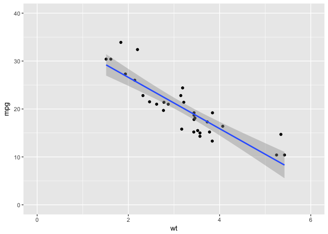
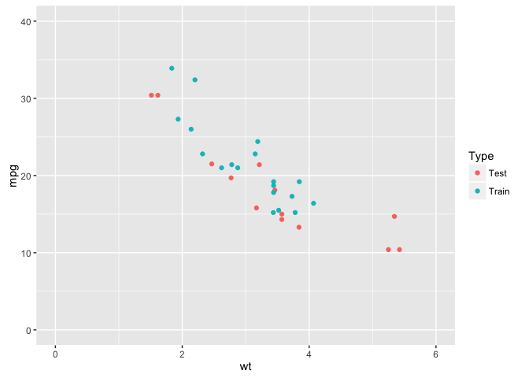

<!-- README.md is generated from README.Rmd. Please edit that file -->
scorer
======

[](http://www.repostatus.org/#active) [](https://img.shields.io/badge/R%20Version-3.2.3+-blue.svg) [](http://cran.r-project.org/package=scorer) [](http://cran.rstudio.com/package=scorer) [](https://travis-ci.org/paulhendricks/scorer) [](https://ci.appveyor.com/project/paulhendricks/scorer/branch/master) [](http://codecov.io/github/paulhendricks/scorer?branch=master)

`scorer` is a set of tools for quickly scoring models in data science and machine learning. This toolset is written in C++, where possible, for blazing fast performance. This toolset's API follows that of [sklearn.metrics](http://scikit-learn.org/stable/modules/classes.html#sklearn-metrics-metrics) as closely as possible so one can easily switch back and forth between the two languages without too much cognitive dissonance. The following types of metrics are currently implemented in `scorer`:

-   Regression metrics (implemented in 0.2.0)

The following types of metrics are soon to be implemented in `scorer`:

-   Classification metrics (to be implemented in 0.3.0)
-   Multilabel ranking metrics (to be implemented in 0.3.0)
-   Clustering metrics (to be implemented in 0.3.0)
-   Biclustering metrics (to be implemented in 0.3.0)
-   Pairwise metrics (to be implemented in 0.3.0)

News
----

scorer 0.2.0
============

Improvements
------------

-   All functions from scorer 0.1.0 have been deprecated in favor of a new API that mirrors the API of [sklearn.metrics](http://scikit-learn.org/stable/modules/classes.html#sklearn-metrics-metrics). These functions will be removed in 1.0.0.
-   Added more functions!
-   Nearly all functions implemented in C++ for blazing fast speed!
-   Additional features such as sample weighting for some error metrics have been identified and placed on a backburner for future releases.

scorer 0.1.0
============

Improvements
------------

-   Implemented several functions for estimating errors.
-   First minor version release to CRAN!

Bug fixes
---------

-   Fixed minor error in passing multiple arguments to `mae()`.

Installation
------------

You can install:

-   the latest released version from CRAN with

    [](http://cran.r-project.org/package=scorer)

    ``` r
    install.packages("scorer")
    ```

-   the latest development version from Github with

    [](https://img.shields.io/badge/Github-0.2.0-brightgreen.svg)

    ``` r
    if (packageVersion("devtools") < 1.6) {
      install.packages("devtools")
    }
    devtools::install_github("paulhendricks/scorer")
    ```

If you encounter a clear bug, please file a minimal reproducible example on [github](https://github.com/paulhendricks/scorer/issues).

API
---

### Regression metrics

#### Load library and data

``` r
library("scorer")
packageVersion("scorer")
#> [1] '0.2.0'
data(mtcars)
```

#### Visualize data

``` r
library("ggplot2")
ggplot(mtcars, aes(x = wt, y = mpg)) + 
  geom_point() + 
  geom_smooth(method = 'lm') + 
  expand_limits(x = c(0, 6), y = c(0, 40))
```



#### Partition data into train and test sets

``` r
set.seed(1)
n_train <- floor(nrow(mtcars) * 0.60)
n_test <- nrow(mtcars) - n_train
mask <- sample(c(rep(x = TRUE, times = n_train), rep(x = FALSE, times = n_test)))
mtcars[, "Type"] <- ifelse(mask, "Train", "Test")
train_mtcars <- mtcars[mask, ]
test_mtcars <- mtcars[!mask, ]
ggplot(mtcars, aes(x = wt, y = mpg, color = Type)) + 
  geom_point() + 
  expand_limits(x = c(0, 6), y = c(0, 40))
```



#### Build a model on train data set

``` r
model <- lm(mpg ~ wt, data = train_mtcars)
```

#### Predict model using the test data set

``` r
test_mtcars[, "predicted_mpg"] <- predict(model, newdata = test_mtcars)
```

#### Score model using various metrics

``` r
scorer::mean_absolute_error(test_mtcars[, "mpg"], test_mtcars[, "predicted_mpg"])
#> [1] 3.287805
scorer::mean_squared_error(test_mtcars[, "mpg"], test_mtcars[, "predicted_mpg"])
#> [1] 15.43932
```

#### Build a final model on all the data

``` r
final_model <- lm(mpg ~ wt, data = mtcars)
```

#### Predict final model using the original data set

``` r
mtcars[, "predicted_mpg"] <- predict(final_model, newdata = mtcars)
```

#### Score final model using various metrics

``` r
scorer::explained_variance_score(mtcars[, "mpg"], mtcars[, "predicted_mpg"])
#> [1] 847.7252
scorer::unexplained_variance_score(mtcars[, "mpg"], mtcars[, "predicted_mpg"])
#> [1] 278.3219
scorer::total_variance_score(mtcars[, "mpg"], mtcars[, "predicted_mpg"])
#> [1] 1126.047
scorer::r2_score(mtcars[, "mpg"], mtcars[, "predicted_mpg"])
#> [1] 0.7528328
```

### Classification metrics

``` r
# TO BE UPDATED
```

People
------

-   The original author of `scorer` is [@Paul Hendricks](<https://github.com/paulhendricks>). [](https://gratipay.com/~paulhendricks/)

-   The lead maintainer of `scorer` is [@Paul Hendricks](<https://github.com/paulhendricks>). [](https://gratipay.com/~paulhendricks/)

License
-------

[](https://github.com/paulhendricks/scorer/blob/master/LICENSE)

Session Information
-------------------

``` r
sessionInfo()
#> R version 3.2.3 (2015-12-10)
#> Platform: x86_64-apple-darwin13.4.0 (64-bit)
#> Running under: OS X 10.11.3 (El Capitan)
#> 
#> locale:
#> [1] en_US.UTF-8/en_US.UTF-8/en_US.UTF-8/C/en_US.UTF-8/en_US.UTF-8
#> 
#> attached base packages:
#> [1] stats     graphics  grDevices utils     datasets  methods   base     
#> 
#> other attached packages:
#> [1] ggplot2_2.0.0 scorer_0.2.0 
#> 
#> loaded via a namespace (and not attached):
#>  [1] Rcpp_0.12.3      digest_0.6.9     plyr_1.8.3       grid_3.2.3      
#>  [5] gtable_0.1.2     formatR_1.2.1    magrittr_1.5     evaluate_0.8    
#>  [9] scales_0.3.0     stringi_1.0-1    rmarkdown_0.8.1  labeling_0.3    
#> [13] tools_3.2.3      stringr_1.0.0    munsell_0.4.2    yaml_2.1.13     
#> [17] colorspace_1.2-6 htmltools_0.2.6  knitr_1.12
```
