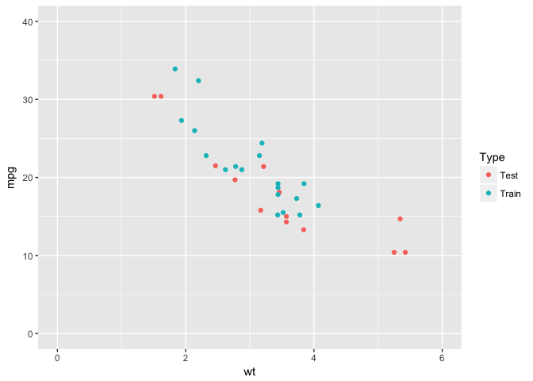

<!-- README.md is generated from README.Rmd. Please edit that file -->
scorer
======

[](http://cran.r-project.org/package=scorer) [](https://cran.rstudio.com/web/packages/scorer/index.html) [](https://travis-ci.org/paulhendricks/scorer) [](https://ci.appveyor.com/project/paulhendricks/scorer/branch/master) [](http://codecov.io/github/paulhendricks/scorer?branch=master) [](http://www.repostatus.org/#active)

`scorer` is a set of tools for quickly scoring models in data science and machine learning. This toolset is written in C++, where possible, for blazing fast performance. This toolset's API follows that of Python's [sklearn.metrics](http://scikit-learn.org/stable/modules/classes.html#sklearn-metrics-metrics) as closely as possible so one can easily switch back and forth between R and Python without too much cognitive dissonance. The following types of metrics are currently implemented in `scorer`:

-   Regression metrics (implemented in 0.2.0)
-   Classification metrics (implemented in 0.3.0)

The following types of metrics are soon to be implemented in `scorer`:

-   Multilabel ranking metrics (to be implemented in 0.4.0)
-   Clustering metrics (to be implemented in 0.4.0)
-   Biclustering metrics (to be implemented in 0.4.0)
-   Pairwise metrics (to be implemented in 0.4.0)

Installation
------------

You can install the latest development version from CRAN:

``` r
install.packages("scorer")
```

Or from GitHub with:

``` r
if (packageVersion("devtools") < 1.6) {
  install.packages("devtools")
}
devtools::install_github("paulhendricks/scorer")
```

If you encounter a clear bug, please file a [minimal reproducible example](http://stackoverflow.com/questions/5963269/how-to-make-a-great-r-reproducible-example) on [GitHub](https://github.com/paulhendricks/scorer/issues).

Examples
--------

### Regression metrics

#### Load library and data

``` r
library("scorer")
packageVersion("scorer")
#> [1] '0.3.0'
data(mtcars)
```

#### Visualize data

``` r
library("ggplot2")
ggplot(mtcars, aes(x = wt, y = mpg)) + 
  geom_point() + 
  geom_smooth(method = 'lm') + 
  expand_limits(x = c(0, 6), y = c(0, 40))
```


#### Partition data into train and test sets

``` r
set.seed(1)
n_train <- floor(nrow(mtcars) * 0.60)
n_test <- nrow(mtcars) - n_train
mask <- sample(c(rep(x = TRUE, times = n_train), rep(x = FALSE, times = n_test)))
mtcars[, "Type"] <- ifelse(mask, "Train", "Test")
train_mtcars <- mtcars[mask, ]
test_mtcars <- mtcars[!mask, ]
ggplot(mtcars, aes(x = wt, y = mpg, color = Type)) + 
  geom_point() + 
  expand_limits(x = c(0, 6), y = c(0, 40))
```



#### Build a model on train data set

``` r
model <- lm(mpg ~ wt, data = train_mtcars)
```

#### Predict model using the test data set

``` r
test_mtcars[, "predicted_mpg"] <- predict(model, newdata = test_mtcars)
```

#### Score model using various metrics

``` r
scorer::mean_absolute_error(test_mtcars[, "mpg"], test_mtcars[, "predicted_mpg"])
#> [1] 3.287805
scorer::mean_squared_error(test_mtcars[, "mpg"], test_mtcars[, "predicted_mpg"])
#> [1] 15.43932
```

#### Build a final model on all the data

``` r
final_model <- lm(mpg ~ wt, data = mtcars)
```

#### Predict final model using the original data set

``` r
mtcars[, "predicted_mpg"] <- predict(final_model, newdata = mtcars)
```

#### Score final model using various metrics

``` r
scorer::explained_variance_score(mtcars[, "mpg"], mtcars[, "predicted_mpg"])
#> [1] 847.7252
scorer::unexplained_variance_score(mtcars[, "mpg"], mtcars[, "predicted_mpg"])
#> [1] 278.3219
scorer::total_variance_score(mtcars[, "mpg"], mtcars[, "predicted_mpg"])
#> [1] 1126.047
scorer::r2_score(mtcars[, "mpg"], mtcars[, "predicted_mpg"])
#> [1] 0.7528328
```

Citation
--------

To cite package ‘scorer’ in publications use:

    Paul Hendricks (2016). scorer: Quickly Score Models in Data Science and Machine Learning. R package version 0.2.0. https://CRAN.R-project.org/package=scorer

A BibTeX entry for LaTeX users is

    @Manual{,
      title = {scorer: Quickly Score Models in Data Science and Machine Learning},
      author = {Paul Hendricks},
      year = {2016},
      note = {R package version 0.2.0},
      url = {https://CRAN.R-project.org/package=scorer},
    }
